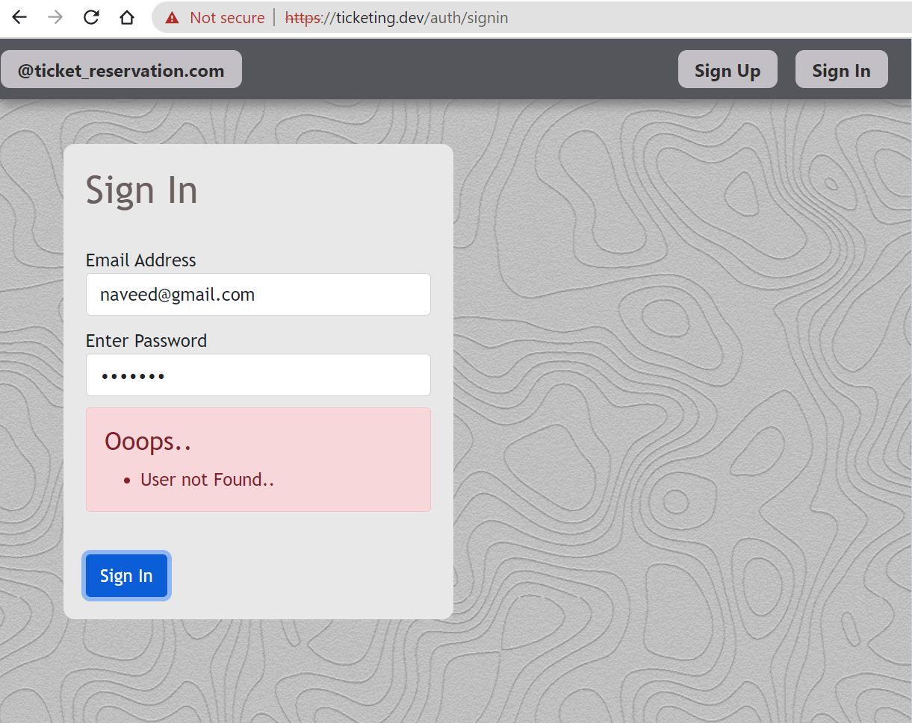
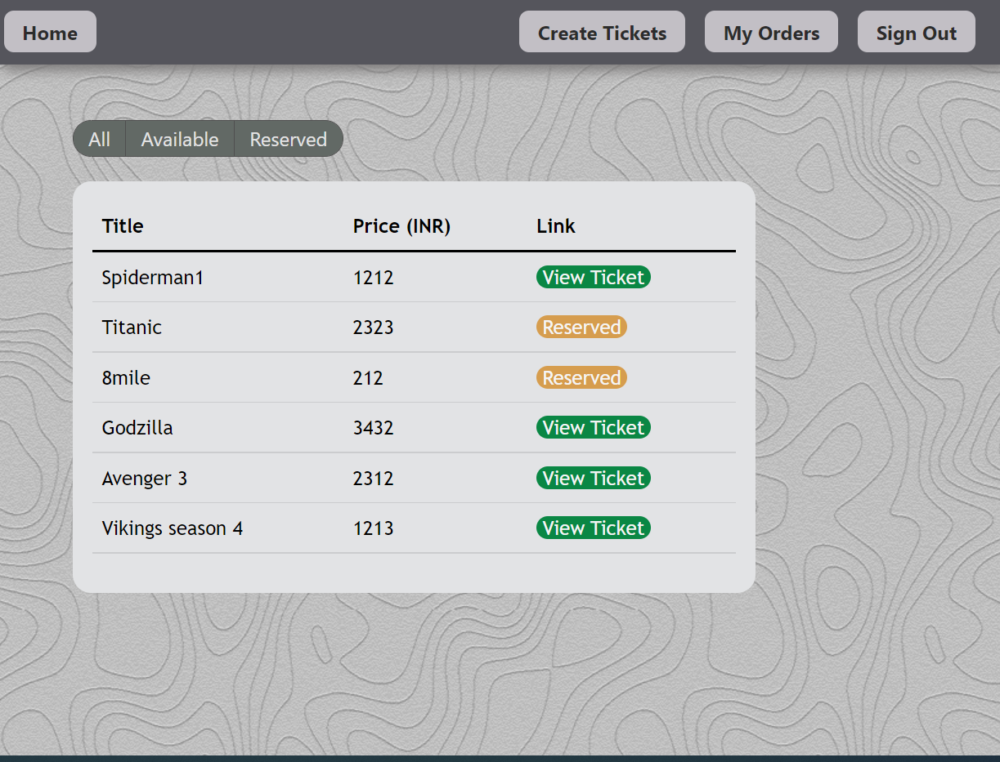
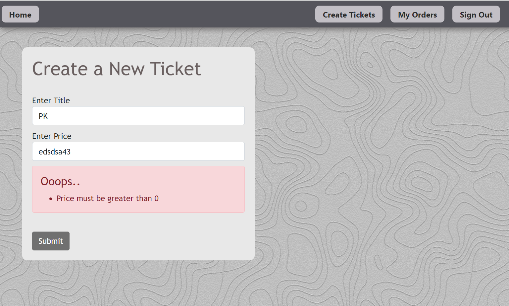
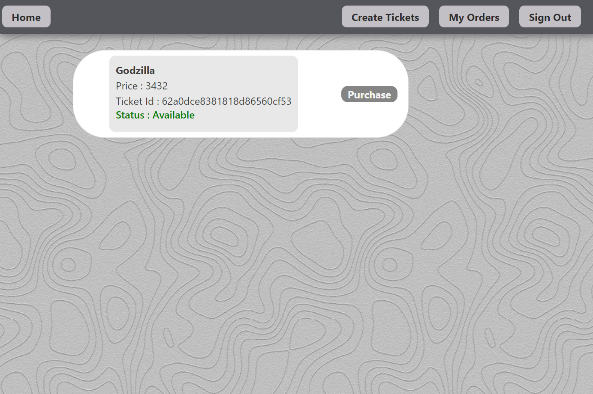
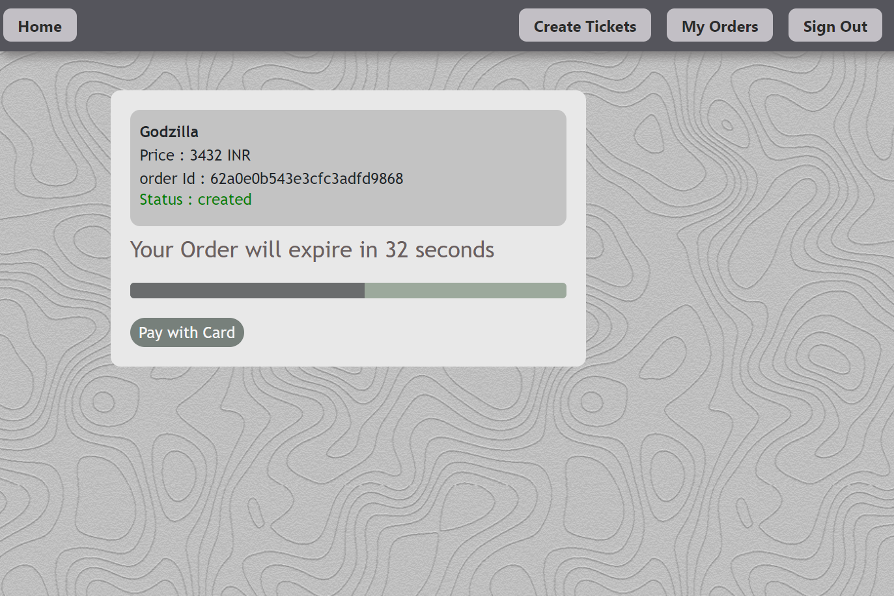
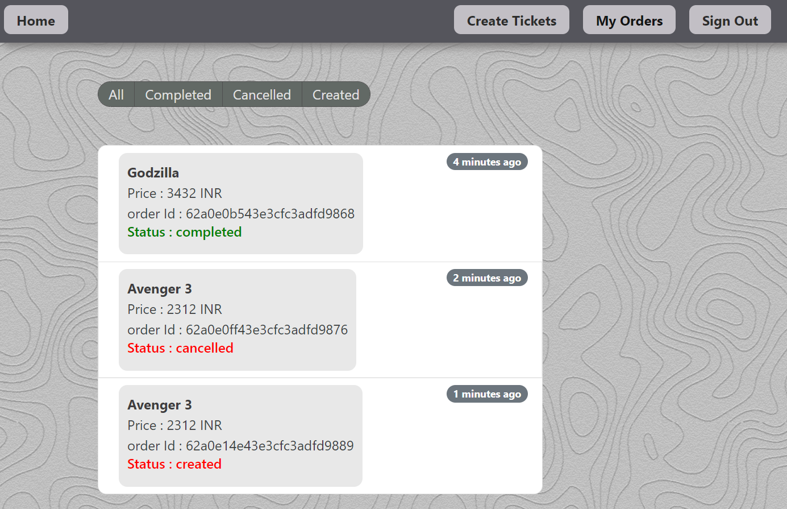

# Ticket-Reservation-App

"Microservices", a trending buzz word nowadays. Many organizations nowadays are migrating from monolithic application to micro-services based application.
In this project you gonna find out how how multiple services run independently leveraging on the best microservices patterns to enable scale, performance and resilience. Tough the project is having limited functionaity but its backend implementaion is very very huge.

# Use-case
This application has 7 different services. Each of the service has its own mongoDB database respectively. All these services are converted into Docker image and then pushed into kubernetes container and further the traffic is controlled using nginx. I have implemented messagaing queue system using NATS-streaming for inter communication within services.

<h4> Below are the few screen shots of application </h4>

# Technology

Ticket Reservation project uses a number of open source projects to work properly:

Nodejs - Application framework
nginx - API Gateway (Load Balancer)
Docker - Containerization platform
Kubernetes - To create instance of docker image and run pods
NATS-Streaming - Asynchronous Micro Services Messaging.
React - HTML enhanced for web apps!
Bootstrap - great UI boilerplate for modern web apps
Type Script and Js - Programming Languages
Git - Version control

# Development

Below are the steps to bring up the development environment and get started.
Clone the project (https://github.com/naveedamir484/Ticket-Reservation-App)
Install Git, Nodejs, skaffold, kubernetes and Docker
Do NPM install for all services
Execute "cd /ticketing/"
To deploy run "skaffold dev"
Access the Application at  "ticketing.dev"

